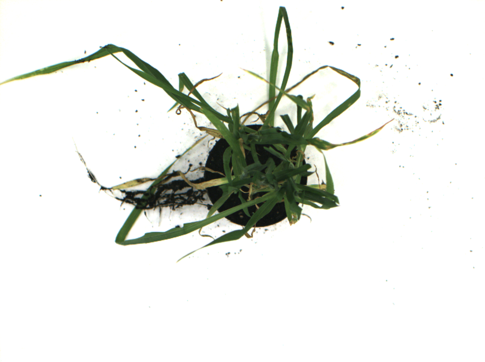

# BASF Challenge: Plant Disease Severity Estimation


---
**Author**: Manuel Ramos Calderón
**Date**: 30/05/2023
---

The challenge is to create a deep learning model, that can predict the disease rating, from an input image. It should be evaluated if a performant model can be created from the given dataset.




## Environment Setup 🚀

_If your machine has a CUDA-capable GPU, make sure to install the necessary drivers beforehand. For example, I have installed CUDA 11.7 to be able to run models on my GPU._

_This repository was developed using **Python 3.10**, and so the package versions that figure in the requirements.txt file have been checked against this version_


### Installation 📋

_It is always advisable to install each project package requirements in an isolated virtual environment._

You can, for example, use conda to create it:

```
conda create -n envBASFChallenge python=3.10 --no-default-packages
```

Then activate your new environment:

```
conda activate envBASFChallenge
```

And lastly install all packages required from _requirements.txt_:

```
pip install -r requirements.txt --extra-index-url https://download.pytorch.org/whl/cu117
```

## Training the model ⚙️

To train a ResNet-18 model on the 5 folds divided from the original dataset use [train_image_regressor.py](train_image_regressor.py)

```
python train_image_regressor.py
```

If you want to visualize the training losses and results on Tensorboard:

```
tensorboard --logdir=runs_resnet18
```

and open your web browser on the specified output URL (usually is  http://localhost:6006/)


## Extracting Image Features With ResNet-18 model 🔩

In order to train a Support Vector Regressor (SVR), we need first to extract the image features from the trained ResNet-18 model by executing [extract_image_features.py](extract_image_features.py):

```
python extract_image_features.py
```

## Training a Support Vector Regressor on the Extracted Features ⌨️

Once the features are extrated, we can train a SVR that will fit to the train+validation data, and test the results on the test data [train_svm_regressor.py](train_svm_regressor.py):

```
python train_svm_regressor.py
```

## Citations 🛠️

_This challenge was accomplished using the following tools or inspired from the following scientific articles:_

* [PyTorch](https://pytorch.org/docs/stable/index.html) - Deep Learning Framework
* [Tensorboard](https://www.tensorflow.org/tensorboard?hl=es-419) - TensorFlow's visualization toolkit
* [Shi, T., Liu, Y., Zheng, X. et al. Recent advances in plant disease severity assessment using convolutional neural networks. Sci Rep 13, 2336 (2023)](https://doi.org/10.1038/s41598-023-29230-7)
* [Saberi Anari, M. J A hybrid model for leaf diseases classifcation based on the modifed deep transfer learning and ensemble
approach for agricultural AIoT-Based monitoring. Comput. Intell. Neurosci. 2022 (2022)](https://doi.org/10.1155/2022/6504616)

## Author/s ✒️

* **Manuel Ramos Calderón** - *Full implementation* - [manuelrames](https://github.com/manuelrames)
